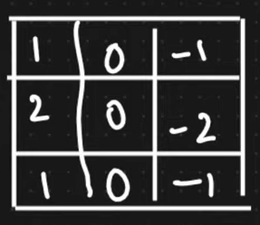

# CNN 
## Convolution in Nutshell:

## 1) Convolution:
- Lets take photos, There are 2 types of photos: Black& White anf RGB
- B7W has only one channel , RGB has 3 channels
#### In B&W images:
- Lets divide the image into pixels, Lets say lets divide into 5x5 matrix, Each pixel's value ranges between 0 to 255( 0 is black 255 is white)

#### In RGB images:
- 3 channels are there: Red channel , Green channel and Blue channel

- Each pixel's value ranges between 0-255

##### coming back to COnvolution,  Consider an image represented as 6x6 matrix, and a 3x3 kernel
- First step in Convolution: Bring all the values in the pixel between **0 and 1** , for this we need to divide each pixel by 255. (**this is called MinMax scaling**)

- Filter with value [[1,2,1][0,0,0][-1,-2,-1]] is called **Horizontal Edge Filter**
- Through Convolution, we slide the Filter Over the image. Starting with the image below

- While sliding we should do element wise multiplication and add all the product as sum. this sum constitutes the index of Result matrix
- **stride** determines the number of steps we slide everytime. For this we use Stride=1

- Below image is Vertical Edge Detector:

- with the help of this, the resultant matrix helps us to detect Where are the Edges in the real image

### Filters Help to take Information from the Specific Image

### Relation Between Image matrix, Filter and Result matrix size:

### Padding:
#### Due to  convolution, the image size is being reduced , this leads to Loss of Information!
#### This can be solved by padding. This involves building another layer over the exisiting Image matirx
#### Types of padding: Zero paddiing: The New Cells is filled with value of 0

### Backpropagation in CNN:
#### In NN , during backpropagation we trained by updating the WEIGHTS, here in the in CNN , we need to make sure to update the Weights **based on the Input Image**
#### Activation Function: On top of each element in the result matrix, ReLU Activation function is applied
#### **Reason to use ReLU**: Derivative can be found for this. Therefore we will be able to do Back Propagation, and based on that we will be able to update the Filters/kernels.

## 2) Max Pooling:
- Consider a situation where Convolution is Completed and we have got the resultant matrix
- Conmsider we are using a 2x2 matrix for Max Pooling
- MaxPooling involves extracting more information from a specifiv Image
- Aim: The Upcoming CNN filters must extract more and more informations than the current layer's filter
- #### Types of Pooling:
- - Average Pooling
- - Min pooling
- - max pooling
#### by using these Pooling techniques, the Layer is trained to detect the prescence of particular shape or object irrespective of the location of the object, this is called **Location Invariant**

## 3) Flattening layer:
 #### It's an ANN Dense Layer
 #### In this whatever Input we get from the max pooling, or pooling techniques, we are gonna flatten the matrix into a VECTOR and combine all the filter's output into one single Long vector
 #### This becomes INPUT to the Dense Layer
 #### Image Classification happens here.
